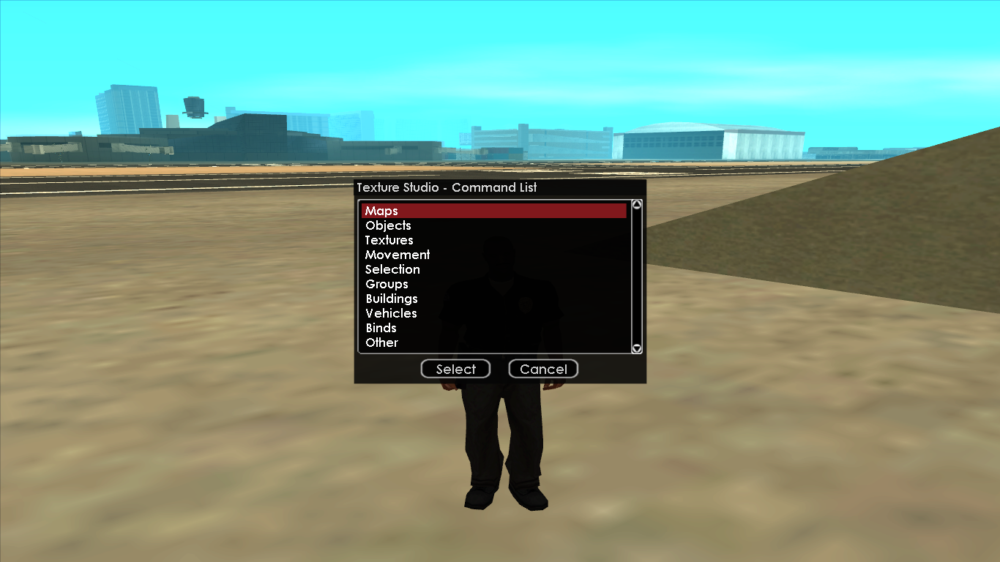
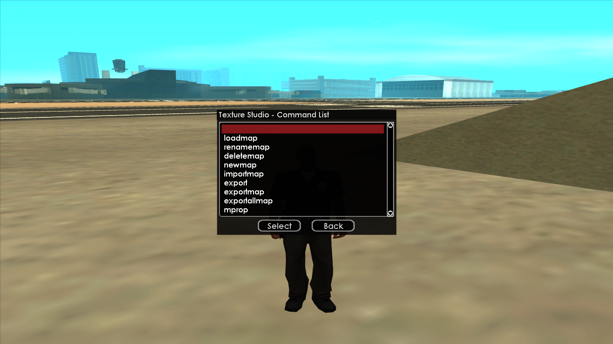
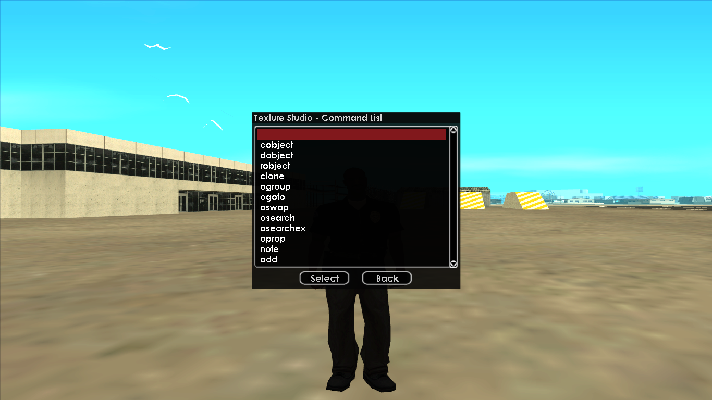
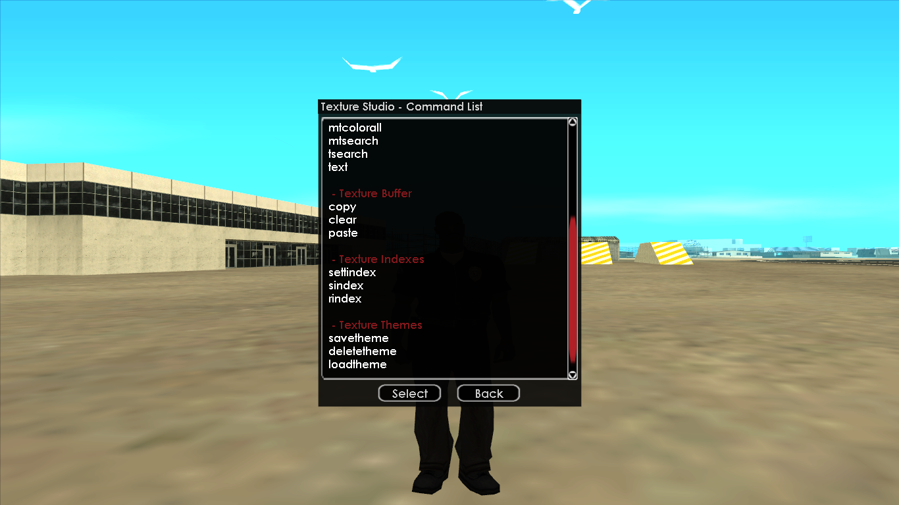
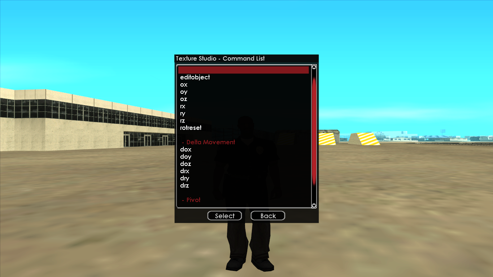
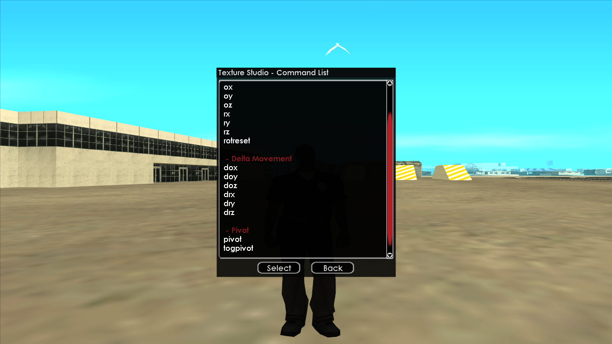
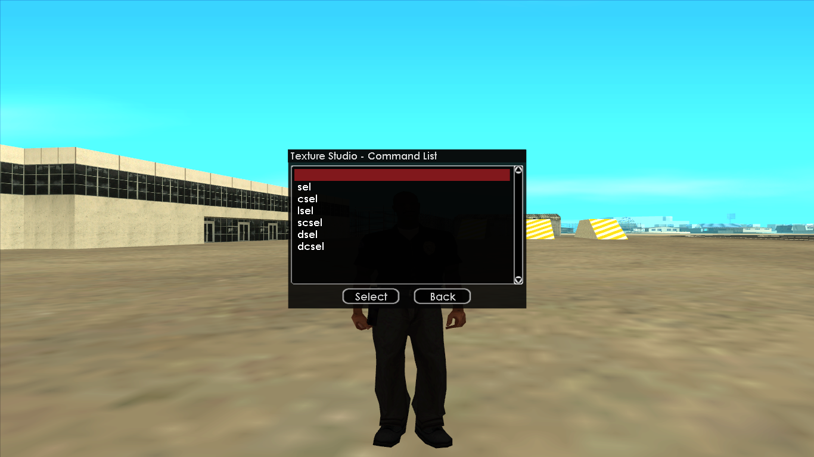
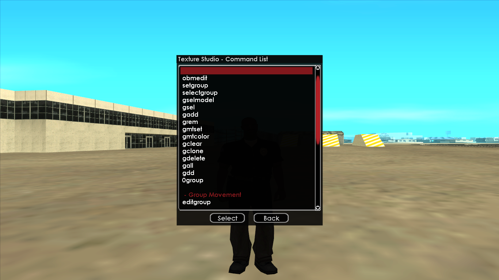
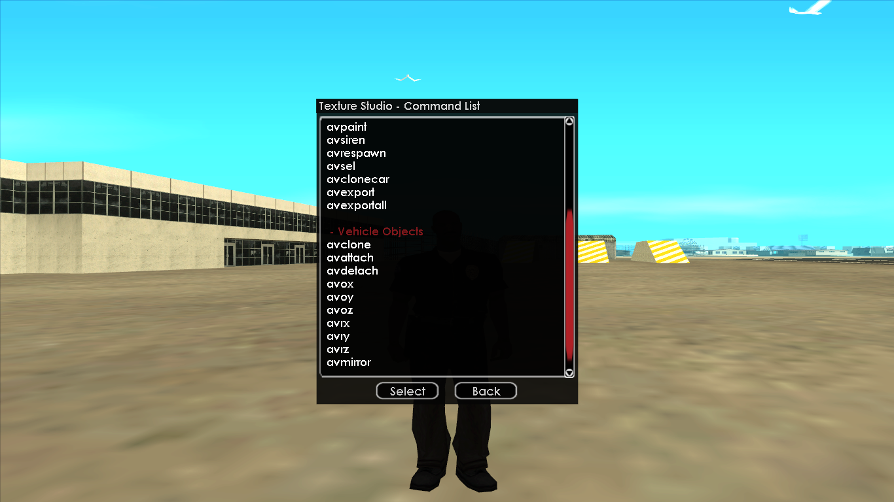
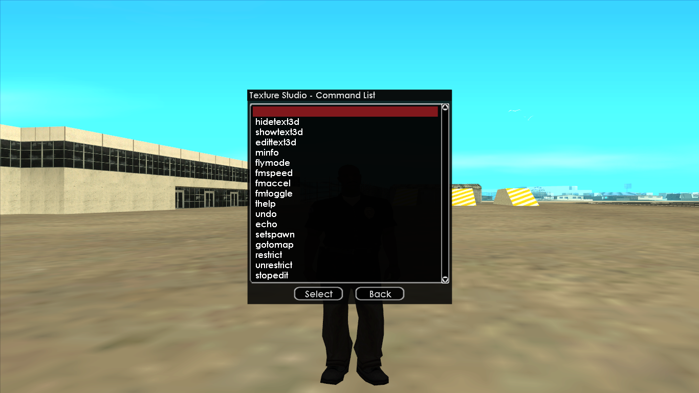

# 📜 <span style="color:orange">**TUTORIAL DE USO DO TEXTURE STUDIO [1.9/2.1]**

Uma vez que a versão 2.1 do **TS** ou **Texture Studio** ([<span style="color:#ffc286;text-decoration:underline">**Download**](https://www.mediafire.com/file/ljj5e8xpxgvgg8m/TextureStudio2.1.zip/file)) não é open source e não é fácil e/ou possível de realizar uma tradução caseira mexendo nos arquivos, resolvi construir esse tutorial escrito para auxiliar no aprendizado de vocês no programa. **Caso o(a) senhor(a) não seja muito fã de percorrer uma grande leitura, [<span style="color:#ffc286;text-decoration:underline">existe este tutorial do Barba Negra no Youtube](https://www.youtube.com/watch?v=svk9jNjyROE&pp=ygUodHV0b3JpYWwgdGV4dHVyZSBzdHVkaW8gc2FtcCBiYXJiYSBuZWdyYQ%3D%3D)**!

Assim que baixado e extraído os arquivos, você irá entrar na pasta e executar o arquivo **samp-server.exe**. Este programa irá executar um servidor local para que você possa entrar e realizar as devidas edições nos seus mapas (<span style="color:orange">enquanto precisar do servidor aberto, não feche a janela do CMD que irá abrir!</span>).
Para acessar o servidor local, você precisará adicionar o seu IPv4 como um novo servidor no launcher do SA-MP ou OpenMP.
```
Não sabe pegar o seu IPv4? Sem problemas. Abra o seu CMD ou Windows Terminal e digite "ipconfig", sem aspas. Agora basta copiar os números que estarão na frente e colar no launcher!
```

> ### 🏠 1 - **Página inicial**
>
Esta é a primeira página ao utilizar o comando `/thelp`, ao qual mostra todas as funções que o TextureStudio tem.
***

> ### 🗺️ 2 - **Aba *Maps***
> 
> ### 2.1 - Comandos gerais
> Comando | Atalho TS 2.1 | Descrição
> -- | :--: | --
> `/loadmap` | - | Comando responsável por carregar os mapas que você terá salvo na pasta "*Texture Studio 2.1/scriptfiles/tstudio/SavedMaps*". Os arquivos de mapas poderão ter como extensão **.db** ou **.pwn**! Tenha em mente que apenas o primeiro consegue carregar corretamente texturas, materiais ou textos.<br><br> <ul><li>Você pode, inclusive, arrastar mapas para dentro desta pasta e carregá-los in-game mesmo estando online no servidor local.<li>Você também pode usar este comando para fechar o mapa atualmente carregado. Basta confirmar a caixa de diáologo que irá abrir após o uso do comando. <span style="color:orange">**Vale ressaltar que, se você tinha algum objeto removido do mapa original nesse último mapa, o TS não conseguirá recolocar o objeto; então você terá que relogar para que o mesmo reapareça.**
> `/renamemap` | - | Com este comando você consegue renomear os seus mapas. Um detalhe é que na versão 1.9 ele permite que você possa renomear usando letras maiúsculas, adicionar espaços, acentos e outros caraceres; já na versão 2.1 você só pode renomear com caracteres comuns (letras), nenhum espaço e tudo em minúsculo.
> `/deletemap` | - | Utilizando este comando você irá deletar o mapa atual. Apesar de aparecer uma janela para você confirmar a ação, tome cuidado para não causar nenhum acidente!<br><br> <ul><li>Aqui o que está escrito em laranja em `/loadmap` também se aplica!
> `/newmap` | - | Cria um novo mapa. Irá aparecer uma nova janela para você adicioanr o nome do mapa — aqui as regra do **renamemap** também se aplica. Se você já tiver um mapa aberto e executar essa ação, o mapa que você está editando será salvo e fechado e o novo mapa será criado.
> `/importmap` | - | Com este comando você pode **mesclar** dois mapas em um só. Por exemplo, imagine que você criou um mapa *x* e queira juntar em um arquivo só com o mapa *y*, basta utilizar este comando e confirmar a ação na janela que irá abrir. Pronto! Agora os dois mapas estão em um arquivo só.<br><br> <ul><li><span style="color:orange">**OBSERVAÇÃO:**</span> O limite de objetos do TS é 10.000! Tome cuidado para não ultrapassar este limite e acabar causando uma grande confusão nos seus projetos.
> `/export` | - | Este comando irá abrir o menu de exportação.
> `/exportmap` | - | Este comando irá agilizar a exportação de mapas, sem precisar passar pelo menu de exportação no `/export`.
> `/exportallmap` | - | Com este você irá exportar **todos** os mapas que estiverem na pasta *SavedMaps*.
> `/mprop` | - | Com este você pode mexer nas propriedades do mapa que você está editando, como o ID do **interior** e/ou o **mundo virtual** em que o mapa se encontra.
***

> ### 📦 3 - **Aba *Objects***
> 
> ### 3.1 - Comandos gerais
> Comando | Atalho TS 2.1 | Descrição
> -- | :--: | --
> `/cobject` | `/co` | Utilizado para criar objetos usando os seus IDs. Você pode acessar [<span style="color:#ffc286;text-decoration:underline">**este site**](https://dev.prineside.com/en/gtasa_samp_model_id/) para te auxiliar com estes IDs!
> `/dobject` | `/do` | Deleta o objeto selecionado.
> `/robject` | - | Com este você reseta todos os materiais, texturas e textos do objeto selecionado.
> `/clone` | - | Cria um clone do objeto selecionado.
> `/ogroup` | `/og` | Altera o ID do grupo do objeto selecionado, usado para editar vários objetos ao mesmo tempo.
> `/ogoto` | - | Da um *teleport* até o objeto selecionado (na versão 1.9 você já precisa estar em flymode).
> `/oswap` | - | Muda o objeto selecionado por outro, usando o ID.
> `/osearch` | - | Faz a busca de um objeto por uma palavra-chave: tree, door, road, barrier, etc.<br><br> <ul><li>Acho importante salientar que esse método de busca irá apenas filtrar aqueles objetos que em seu nome está escrito a palavra-chave. É um comando que ajuda quando você já tem um pouco de noção do que pretende encontrar e como encontrar, mas eu aconselho que utilizem o site que já foi citado no primeiro comando para ir pegando o jeito.
> `/osearchex` | - | <span style="color:orange">Na documentação oficial, é dito que este comando faz uma busca por objetos com base em uma expressão, mas honestamente, nunca entendi direito como funciona.
> `/oprop` | - | Entra no menu de alteração de objetos do objeto selecionado. Basicamente, você pode acessar todas as formas de alterar um objeto, desde mudar o objeto (**/oswap**), mudar o grupo dele (**/ogroup**), mudar cada uma das 15 texturas do objeto, os 15 materiais (cores) do objeto, o texto, adicionar nota e alterar a distância de visualização.
> `/note` | - | Visualiza a nota de um objeto. É uma forma de anotar erros, ideias ou avisos que o TS implementou. Spoiler: ninguém usa.
> `/odd` | - | Altera rapidamente a distância de visualização de um objeto, sendo o padrão **300 metros**.<br><br> <ul><li>Se abusar do valor da distância o servidor local pode vir a cair.
***

> ### 🎨 4 - **Aba *Textures***
> 
> 
> ### 4.1 - Comandos gerais
> Comando | Atalho TS 2.1 | Descrição
> -- | :--: | --
> `/mtextures` | - | Abre o menu com todas as texturas do jogo. Se houver um objeto selecionado e você apertar alt, a textura selecionada será aplicada no primeiro campo de textura do objeto (que por padrão é o campo 0).<br><br> <ul><li>Use os botões Y e H para ir para cima e para baixo, respectivamente.<li>Use os botões NUM 4 e NUM 6 para ir para a página anterior e posterior, respectivamente.<li><span style="color:orange">Caso você esteja em *flymode*, para navegar para cima e para baixo, precisará segurar o botão F ou Enter e utilizar o NUM 4 e NUM 6; para navegar entre as páginas continua a mesma coisa, basta não segurar o F ou Enter.
> `/mtsearch` | - | Funciona semelhante ao /osearch, aqui você irá buscar por uma textura usando uma palavra-chave.<br><br> <ul><li>Este não mostra de fato qual é a textura, mas apenas o seu nome. Tem [<span style="color:#ffc286;text-decoration:underline">**esse site**](https://gtxd.net/?search=&page=1&show=100&noDuplicates=1) que é bem legal e você poderá pesquisar as texturas e visualizá-las.
> `/ttextures` | - | Envia no chat a explicação de como navegar no /mtextures, assim como já expliquei anteriormente.
> `/stexture` | - | Um editor de texturas complexo de compreender, pois o *UI* (User Interface) não ajuda muito.<br><br> <ul><li>🟥 - Remove todas os materiais, texturas e textos do objeto.<li>🟦 - Altera a cor do objeto diante de algumas opções.<li>🟩 - Faz a seleção do campo de textura do objeto que você irá editar.
> `/mtset` | - | Adiciona uma textura ao objeto selecionado. Este comando recebe dois argumentos: **/mtset <CAMPO_TEXTURA (0-15)> <INDEX_TEXTURA>**. Por exemplo, imagine que quero alterar o campo ID 6 de um objeto qualquer com a textura ID 15, para isso eu vou – com o objeto já selecionado –, digitar /mtset 6 15.
> `/mtsetall` | - | Funciona da mesma forma que o comando anterior, a diferença agora é que você irá estar trabalhando com grupos. Então todos os objetos do grupo receberão a textura no campo informado.
> `/mtreset` | - | Reseta todos os materiais e texturas do objeto selecionado.
> `/mtcolor` | - | O funcionamento é idêntico ao /mtset, mas agora você irá estar mudando o material do objeto.
> `/mtcolorall` | - | Idêntico ao /mtsetall, mas você estará mudando o material do grupo.
> `/text` | - | Abre o menu de adição de texto a textura 0 do objeto. Aqui você pode adicionar o texto, adicionar cor (você pode, inclusive, adicionar a cor diretamente no texto usando hexadecimal: "*{#101010}Texto*"), mudar a fonte (na versão 2.1 do TS há mais opções), mudar o tamanho da fonte e por aí vai.
> ***
> ### 4.2 - Buffer de textura
> Comando | Atalho TS 2.1 | Descrição
> -- | :--: | --
> `/copy` | - | Copia todas as texturas, materiais e textos do objeto selecionado.
> `/clear` | - | Limpa a cópia de propriedades que você fez com o `/copy`.
> `/paste` | - | Cola essas propriedades em outro objeto que você irá selecionar.
> ***
> ### 4.3 - Index de texturas
> Comando | Atalho TS 2.1 | Descrição
> -- | :--: | --
> `/settindex` | - | Lembra quando eu falei do macete de apertar alt para indexar uma textura rapidamente no comando `/mtextures`? Lá eu falei que o campo padrão é 0, mas com o comando **/settindex** você pode mudar este campo padrão (0-15).
> `/sindex` | - | Este comando vai ter permitir visualizar cada campo de textura do objeto selecionado diretamente no objeto. **Este comando é especialmente útil!**
> `/rindex` | - | Este desfaz a ação do comando anterior.
> ***
> ### 4.4 - Temas de textura
> Comando | Atalho TS 2.1 | Descrição
> -- | :--: | --
> `/savetheme` | - | Com este comando você poderá armazenar texturas em temas para serem usados posteriormente.
> `/deletetheme` | - | Apaga um tema.
> `/loadtheme` | - | Carrega um tema.
***

> ### ⚙️ 5 - **Aba *Movement***
> 
> 
> ### 5.1 - Comandos gerais
> Comando | Atalho TS 2.1 | Descrição
> -- | :--: | --
> `/editobject` | `/eo` | Este comando permitirá que você edite livremente a posição do objeto em 3 dimensões, assim como rotacioná-lo.
> `/ox` | - | Edita diretamente o deslocamento x do objeto.
> `/oy` | - | Edita diretamente o deslocamento y do objeto.
> `/oz` | - | Edita diretamente o deslocamento z do objeto.
> `/rx` | - | Edita diretamente a rotação x do objeto.
> `/ry` | - | Edita diretamente a rotação y do objeto.
> `/rz` | - | Edita diretamente a rotação z do objeto.
> `/rotreset` | - | Reseta todos os eixos de rotação do objeto para 0.
> ***
> ### 5.2 - Movimento delta
> Comando | Atalho TS 2.1 | Descrição
> -- | :--: | --
> `/dox` | - | Edita diretamente o deslocamento x de **todos os objetos do mapa**.
> `/doy` | - | Edita diretamente o deslocamento y de **todos os objetos do mapa**.
> `/doz` | - | Edita diretamente o deslocamento z de **todos os objetos do mapa**.
> `/dox` | - | Edita diretamente a rotação x de **todos os objetos do mapa**.
> `/doy` | - | Edita diretamente a rotação y de **todos os objetos do mapa**.
> `/doz` | - | Edita diretamente a rotação z de **todos os objetos do mapa**.
> ***
> ### 5.3 - Pivô
> Comando | Atalho TS 2.1 | Descrição
> -- | :--: | --
> `/pivot` | - | <span style="color:orange">**NÃO FAÇO A MENOR IDEIA DO QUE ISSO FAZ 🤷🏻‍♂️.**
> `/togpivot` | - | <span style="color:orange">**NÃO FAÇO A MENOR IDEIA DO QUE ISSO FAZ 🤷🏻‍♂️.**
***

> ### 📲 6 - **Aba *Selection***
> 
> ### 6.1 - Comandos gerais
> Comando | Atalho TS 2.1 | Descrição
> -- | :--: | --
> `/sel` | - | Seleciona um objeto pelo ID dele no TS, não confundir com o ID do objeto no GTA.
> `/csel` | - | Seleciona objetos com o mouse. Quando os objetos estão mais dispersos, este comando vem a ser mais útil.
> `/lsel` | - | Abre uma visualização de todos os objetos para que você possa selecionar.
> `/scsel` | - | Seleciona o objeto mais próximo.
> `/dsel` | - | Desseleciona o objeto atual.
> `/dcsel` | - | Destrói o objeto mais próximo.
***

> ### 👥 7 - **Aba *Groups***
> 
> 
> ### 7.1 - Comandos gerais
> Comando | Atalho TS 2.1 | Descrição
> -- | :--: | --
> `/obmedit` | - | Edita a "*objeto-metria*" do objeto. Nunca nadei nessas águas, não sei como funciona exatamente e nem nunca vi em prática.
> `/setgroup` | - | Uma vez que você tenha **agrupado** (nomes parecidos, mas funções ligeiramente diferentes) objetos usando `/gadd`, você pode trocar o grupo deles de uma só vez.<br><br> <ul><li>Vem a ser útil se você quiser organizar objetos idênticos em um grupo só para editá-los com mais facilidade e agilidade.
> `/selectgroup` | - | Seleciona o ID de um grupo.
> `/gselmodel` | - | Seleciona um grupo de objetos pelo ID do modelo.
> `/gsel` | - | Funciona semelhante ao `/csel`, dessa vez você irá estar adicionando objetos a um agrupamento de seleção usando o mouse.<br><br> <ul><li>Se estiver não estiver em flymode, segura o botão H e clique em um objeto que ele será adicinado ao agrupamento de seleção. Segure alt e aperte novamente e ele será removido do agrupamento.<Li>Se estiver em flymode, você terá agora que segurar o botão F ou Enter para adicionar e alt para remover.
> `/gadd` | - | Adiciona por ID TS um objeto ao agrupamento de seleção.
> `/grem` | - | Remove por ID um objeto do agrupamento de seleção.
> `/gmtset` | - | Adiciona uma textura a todos os objetos do grupo de seleção.
> `/gmtcolor` | - | Adiciona material de cor a todos os objetos do grupo de seleção.
> `/gclear` | - | Apaga **apenas** o grupo de seleção, não os objetos nele contidos.
> `/gclone` | `/gc` | Faz um clone dos objetos contidos no grupo de seleção.
> `/gdelete` | `/gd` | Deleta **os objetos** que estão no grupo de seleção.
> `/gall` | - | Adiciona **todos** os objetos do mapa em um grupo de seleção.
> `/gdd` | - | Altera a distância de visão de todos os objetos no grupo de seleção.<br><br> <ul><li>Dependendo da quantidade de objetos, obviamente, vai demorar mais e pode vir a crashar o servidor local.
> `/0group` | - | Leva todos os objetos do grupo de seleção para o ponto zero do mapa de San Andreas (aquele poste perdido no meio da fazenda de Blueberry marca o local).
> ***
> ### 7.1 - Movimento em grupo
> Comando | Atalho TS 2.1 | Descrição
> -- | :--: | --
> `/editgroup` | `/eg` | Semelhante ao `/editobject`, mas agora você irá editar todos os objetos contidos em um grupo de seleção.
> `/gox` | - | Edita diretamente o deslocamento x de um grupo de seleção.
> `/goy` | - | Edita diretamente o deslocamento y de um grupo de seleção.
> `/goz` | - | Edita diretamente o deslocamento z de um grupo de seleção.
> `/grx` | - | Edita diretamente a rotação x de um grupo de seleção.
> `/gry` | - | Edita diretamente a rotação y de um grupo de seleção.
> `/grz` | - | Edita diretamente a rotação z de um grupo de seleção.
> `/ginfront` | - | Move todos os objetos em um grupo de seleção para a frente do usuário.
> `/ginvert` | - | Inverte os eixos x, y ou z dos objetos do grupo de seleção com base na sua escolha.
> ***
> ### 7.2 - Grupo de "pré-fabricados"
> Comando | Atalho TS 2.1 | Descrição
> -- | :--: | --
> `/gaexport` | - | Exporta todos os objetos do grupo de seleção como um objeto de conexão (usado em veículos editados).
> `/gprefab` | - | Cria um pré-fabricado (objetos que você pode utilizar posteriormente) com todos os objetos do grupo de seleção.
> `/prefabsetz` | - | <span style="color:orange">**Honestamente, nem sei como usar este comando. Mas o nome é sugestivo.**</span>
> `/prefab` | - | Mostra os seus pré-fabricados.
***

> ### 🏛️ 8 - **Aba *Buildings***
> 
> ### 8.1 - Comandos gerais
> Comando | Atalho TS 2.1 | Descrição
> -- | :--: | --
> `/gtaobjets` | - | Mostra as informações dos objetos do mapa original, como o ID, nome do objeto e o ID do modelo.
> `/gtashow` | - | **Supostamente** mostraria algo no objeto especificado.
> `/gtahide` | - | **Supostamente** desfaria a ação do comando anterior.
> `/remobject` | - | Remove o objeto original do mapa. <span style="color:orange">**AÇÃO PERMANTENTE!**
> `/rremobject` | - | Remove todos os objetos originais de um modelo especificado e em um raio também especificado. <span style="color:orange">**AÇÃO PERMAMENTE!**
> `/swapbuilding` | - | Muda o objeto original do mapa por outro objeto de sua escolha.
> `/clonebuilding` | - | Faz um clone do objeto original do mapa.
***

> ### 9 - **Aba *Vehicles***
> 
> 
> ### 9.1 - Comandos gerais
> Comando | Atalho TS 2.1 | Descrição
> -- | :--: | --
> `/tcar` | - | Abre uma seleção de veículos temporários do sistema do TS para você utilizar (somem assim que você sai deles).<br><br> <ul><li>Uma alternativa, caso você precise de veículos que fiquem no mapa, é usar o comando /v <id_ou_modelo>.
> `/avnewcar` | - | Cria um novo veículo de modificação.
> `/avmodcar` | - | Você será teleportado para uma garagem de *tunning* do jogo para editar o veículo de modificação selecionado.
> `/avsetspawn` | - | Define o spawn do veículo de modificação selecionado.
> `/avdeletecar` | - | Deleta o veículo de modificação selecionado.
> `/avselectcar` | - | Seleciona um veículo de modificação.
> `/avcarcolor` | - | Altera a cor do veículo de modificação selecionado.
> `/avpaint` | - | Altera a pintura especial (se houver) do veículo de modificação.
> `/avsiren` | - | Insere uma sirene ao veículo de modificação selecionado.
> `/avrespawn` | - | Respawna o veículo de modificação selecionado.
> `/avexport` | - | Abre o menu exportação de arquivo para o veículo de modificação selecionado.
> `/avexportall` | - | Abre o menu de exportação de arquivo para todos os veículos de modificação.
> ***
> ### 9.2 - Objetos em veículos
> Comando | Atalho TS 2.1 | Descrição
> -- | :--: | --
> `/avattach` | - | O objeto que estiver selecionado será colado no veículo também selecionado. Você poderá escolher entre clonar o objeto antes de colar no veículo ou não.
> `/avclone` | - | Clona objeto selecionado colado no veículo de modificação.
> `/avdetach` | - | Desloca o objeto do veículo de modificação.
> `/avox` | - | Edita diretamente o deslocamento x do objeto do veículo de modificação.
> `/avoy` | - | Edita diretamente o deslocamento y do objeto do veículo de modificação.
> `/avoz` | - | Edita diretamente o deslocamento z do objeto do veículo de modificação.
> `/avrx` | - | Edita diretamente a rotação x do objeto do veículo de modificação.
> `/avry` | - | Edita diretamente a rotação y do objeto do veículo de modificação.
> `/avrz` | - | Edita diretamente a rotação z do objeto do veículo de modificação.
> `/avmirror` | - | Funciona semelhante ao `/ginvert`. Porém dessa vez você não precisará adicionar os objetos em um grupo de seleção.
***

> ### 🤖 10 - **Aba *Binds***
> 
> ### 10.1 - Comandos gerais
> Comando | Atalho TS 2.1 | Descrição
> -- | :--: | --
> `/runbind` | - | Roda a macro que você criar.
> `/bindeditor` | - | Abre o painel de adição de macros para facilitar tarefas repetitivas. É algo bem simples, simples até demais, mas vai que serve para você.
***

> ### ✨ 11 - **Aba *Other***
> 
> ### 11.1 - Comandos gerais
> Comando | Atalho TS 2.1 | Descrição
> -- | :--: | --
> `/hidetext3d` | - | Esconde as informações de ID e grupo dos objetos do mapa.
> `/showtext3d` | - | Desfaz a ação do comando anterior.
> `/edittext3d` | - | Escolhe quais informações você quer que seja mostrado nessa label de informações dos objetos.
> `/minfo` | - | Mostra informações de um modelo de objeto, como o raio, as dimensões e etc.
> `/flymode` | `/fm` | Ativa o modo de vôo do TS.
> `/fmspeed` | - | Altera a velocidade do modo de vôo.
> `/fmaccel` | - | Altera a aceleração do modo de vôo.
> `/fmtoggle` | - | Ativa/desativa a aceleração do modo de vôo.
> `/thelp` | - | Abre o painel da página inicial.
> `/undo` | - | Desfaz a última ação que você fez na edição de objetos.
> `/redo` | - | Desfaz a ação do comando anterior.
> `/echo` | - | Emite um texto que você digitar no chat de volta para você, e você apenas.
> `/setspawn` | - | Define o local spawn do mapa que você está editando.
> `/gotomap` | - | Vai diretamente para o ponto de spawn (se houver) do mapa atual.
> `/restrict` | - | Restringe a edição do mapa.
> `/unrestrict` | - | Desfaz a ação anterior.
> `/stopedit` | - | Caso você fique preso na edição de um objeto e não consiga mais ver o painel, use este comando para fechá-lo.